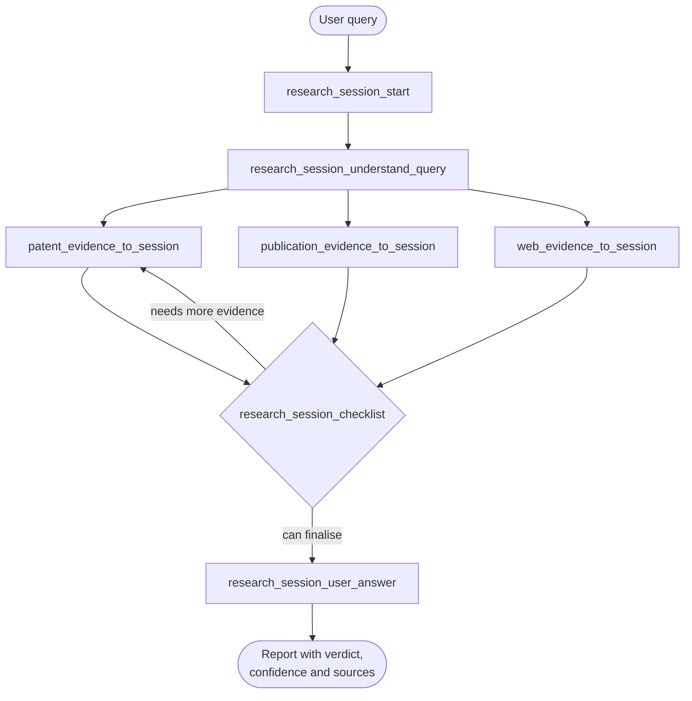

# Novelty Research MCP

[](https://github.com/RobackaB/novelty-research-mcp/actions/workflows/tests.yml)
[](LICENSE)
[](pyproject.toml)

An MCP server for **source-grounded prior-art and novelty research**. Given a plain-language
description of an invention, it searches patents, scientific publications and the web in one
run, verifies what each source actually supports, and returns a report with an explicit
evidence level for every finding.

Orchestrated through [Flowise](https://flowiseai.com/); the retrieval, grading and report
generation happen entirely inside the MCP server.

*[Slovenská verzia README](README.sk.md)*

---

## What it does

Most research assistants return a list of links and let the model summarise them. This server
does the opposite: it decides **what a source actually proves** before anything is written.

- **Three source types in one workflow** — patents, publications and web, each with its own
  providers and fallbacks.
- **Explicit evidence levels** — a claim read from a patent document is not treated the same
  as a search-result snippet (see the table below).
- **Persistent session state** — every attempt, hit and verdict is stored in SQLite, so retries
  and the final report work from recorded evidence rather than conversation history.
- **Retry budgets with a checklist** — the workflow decides on its own whether the evidence is
  good enough to finalise or whether a source needs another attempt.
- **Multilingual input** — a non-English query is paired with an English search variant so
  retrieval quality does not depend on the language the user typed in.
- **Deterministic server side** — query understanding, relevance scoring and report rendering
  use no LLM inside the MCP server. The language model only orchestrates tool calls.

## How it works



The supervisor in Flowise only calls tools and passes identifiers around — it never sees raw
evidence. All retrieval, grading and rendering stay in the MCP server.

### MCP tools

| Tool | Purpose |
|---|---|
| `research_session_start` | Creates or resumes a research session |
| `research_session_understand_query` | Stores the query, its English variant and its requirement elements |
| `patent_evidence_to_session` | Retrieves, grades and stores patent findings |
| `publication_evidence_to_session` | Retrieves, grades and stores publication findings |
| `web_evidence_to_session` | Retrieves, grades and stores web findings |
| `research_session_checklist` | Decides between another retry and finalisation |
| `research_session_user_answer` | Renders the final user-facing report |

### Evidence levels

Every finding carries the level of verification that was actually reached:

| Level | Meaning |
|---|---|
| `claim_verified` | Patent claims were read from the document itself |
| `abstract_verified` | An abstract was retrieved and verified |
| `verified_metadata` / `fetched_excerpt` | Metadata or page text was retrieved |
| `search_snippet_only` | Only a search-result snippet — weak evidence |
| `fetch_failed` / `fetch_timeout` | Retrieval failed; **not** evidence of absence |

## Requirements

- Docker Desktop, installed and running
- An OpenAI API key, set inside Flowise after importing the architecture
- Optional API keys in `.env` for fuller retrieval

Recommended keys (all optional — the system degrades gracefully without them):

| Variable | Used for |
|---|---|
| `GOOGLE_CSE_API_KEY`, `GOOGLE_CSE_ID` | Primary web search backend |
| `TAVILY_API_KEY`, `EXA_API_KEY` | Web and patent search fallbacks |
| `SEMANTIC_SCHOLAR_API_KEY` | Higher rate limits for publication search |

## Quick start

```bash
cp .env.example .env
```

Fill in your keys in `.env`, then:

```bash
docker compose up --build
```

Once both containers are up:

- Flowise — `http://localhost:3000`
- MCP server — `http://localhost:8000/mcp`

The MCP server prints its Flowise connection URL to the terminal on startup.

## Importing the Flowise architecture

1. Open Flowise at `http://localhost:3000`
2. Import `flowise_architecture/Flowise_agent.json`
3. Set your own OpenAI credential for the language model
4. Check that the Custom MCP node points to `http://host.docker.internal:8000/mcp`
   (this is how the Flowise container reaches the MCP server under Docker Desktop)

## Example query

Describe the solution — its purpose, technical elements, how it works and what it should
achieve. English and Slovak inputs are both supported.

```text
Verify whether a system already exists for detecting anomalies in application logs that
processes events in real time, uses machine learning to recognise unusual patterns,
automatically creates an incident and notifies an administrator.
```

The workflow will call the tools in the order shown in the diagram above and return a report
containing a verdict, a confidence level, the retrieval completeness, per-source quality and
a list of the sources it actually used.

**[See a full example report](docs/example-report.md)** produced by an actual run, including
the element-by-element coverage table.

## Troubleshooting

If Flowise returns no answer or the workflow reports an error:

- check that both containers are running — `docker compose ps`
- check that the MCP server responds at `http://localhost:8000/mcp`
- check that the Custom MCP node uses `http://host.docker.internal:8000/mcp`
- check that `.env` contains your API keys
- check that an OpenAI credential is set in Flowise

Logs: `docker compose logs -f`

## Data and shutdown

Flowise state lives in the `flowise_data` Docker volume; the research SQLite database lives in
`mcp_research_data` at `/app/data/research_sessions.sqlite3`.

```bash
docker compose down
```

This keeps the data. To remove the volumes as well:

```bash
docker compose down -v
```

## Development

The test suite needs no network access and no API keys:

```bash
pip install -e ".[dev]"
python -m pytest
```

Relevance quality is measured against a small gold-standard dataset in `eval/`, scored
with precision, recall, F1, P@k, MAP and MRR. Every query is evaluated at the threshold
the server actually applies to its source type, and the harness is offline and
deterministic, so results reproduce exactly:

```bash
python -m eval.relevance_eval
python -m eval.relevance_eval --sweep    # precision/recall trade-off across thresholds
```

The dataset is currently **3 queries and 20 candidates**, which is enough to catch a
broken scorer but far too small to support a claim that one scorer is better than
another. `AUDIT.md` section 14.4 states the measured numbers, the recall trade-off and
this limitation in full.

## Repository contents

| Path | Contents |
|---|---|
| `server.py` | MCP tool registration |
| `server_http.py` | HTTP entry point used by the Docker image |
| `tools/` | Retrieval, storage, verification and grading implementation |
| `flowise_architecture/` | The Flowise architecture to import |
| `flowise_baselines/` | Simpler RAG architectures, used only for comparison |
| `terminal_ui.py` | Startup banner for the HTTP server |
| `tests/` | Test suite, no network access required |
| `eval/` | Relevance evaluation harness and gold-standard dataset |
| `AUDIT.md` | Measured findings behind each change |

## About this repository

This project started as my bachelor's thesis. The `v1.0-thesis` tag marks the code exactly as
it was submitted, with no later edits. Everything after that tag is incremental improvement —
bug fixes, a test suite and measurable output-quality work — so the development remains
traceable from the original submission.
