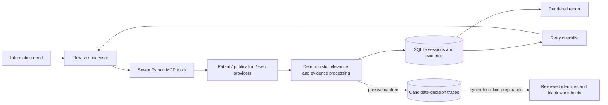

# Novelty Research MCP

[](https://github.com/RobackaB/novelty-research-mcp/actions/workflows/tests.yml)
[](LICENSE)
[](pyproject.toml)

A **Python MCP backend for source-grounded prior-art research** across patents,
scientific publications and the web. It records retrieval attempts and evidence
in SQLite, applies deterministic relevance and evidence rules, and renders a
report that distinguishes verified text, snippets and failed retrieval.

Built for my bachelor's thesis, **AI for Advanced Information Research**, then
hardened through a technical audit, regression tests and reproducible evaluation
work. The `v1.0-thesis` tag preserves the submitted prototype; **0.10.0** is the
post-thesis portfolio milestone, not a production-readiness claim.

[Example report](docs/example-report.md) · [Technical audit](AUDIT.md) ·
[Release verification](docs/portfolio-milestone.md) · [Slovensky](README.sk.md)

## What I built and improved

- **Research backend:** seven MCP tools, asynchronous provider retrieval,
  bounded retries, SQLite session state and source-grounded report generation.
- **Deterministic hardening:** stable scoring/ranking tie-breaks, regression
  tests and defect-restoration negative controls. Identical inputs/configuration
  are the boundary; live provider responses are not deterministic.
- **Passive decision capture:** candidate decisions and query/decomposition
  provenance stored separately from production evidence. Capture failures do not
  change retrieval or retry decisions. Provider errors omit credential-bearing
  exception text.
- **Offline evaluation infrastructure:** read-only snapshot import, explicit
  identity reconciliation, blank blinded worksheets and deterministic original-query
  roster rehearsal. These Goal 5C tools currently accept synthetic inputs only.

## Architecture



The Flowise LLM orchestrates calls and supplies an English translation for
non-English inputs. Retrieval, local scoring, evidence grading and rendering are
Python code. The workflow instructs the supervisor to use compact acknowledgements
and return the report verbatim, rather than rewriting raw evidence.

The tools are `research_session_start`, `research_session_understand_query`,
`patent_evidence_to_session`, `publication_evidence_to_session`,
`web_evidence_to_session`, `research_session_checklist` and
`research_session_user_answer`. Interface tests pin their names and parameters.

## What is measured—and what is not

| Evidence | Current scope |
|---|---|
| Automated verification | 954 tests at the pre-release baseline; Python 3.11–3.13 CI, deterministic subprocess checks and negative controls. |
| Historical relevance benchmark | **3 queries / 20 candidates**; fixed-pool generic-scorer regression benchmark. Query-macro precision **0.611**, recall **0.833**, F1 **0.683**. |
| Goal 5C implementation | Synthetic/offline Phases 1–3 completed; import, reconciliation/blinding and roster-freeze contracts are tested. |
| Real evaluation study | **Not performed.** No new participant acquisition, human labels, workflow metrics or prospective threshold confirmation. |

The benchmark uses shared generic scorer defaults, not a replay of all production
search gates, fallbacks and retries. Its tiny, partly author-constructed dataset
cannot establish general effectiveness, a meaningful improvement percentage or
global retrieval recall. Tests are software checks, not independent study queries.
See [AUDIT §14.4](AUDIT.md#144-measured-result--the-offline-dataset).

This is research assistance, not a proof of novelty or patentability. Provider
blocking, rate limits, lexical matching and incomplete documents limit results.
`claim_verified` means claim text was obtained, not that legal anticipation was
established. Failed retrieval is not evidence that prior art is absent.

## Verify offline first

No API credentials, Docker, browser installation or LLM account are needed for
these checks. Python **3.11–3.13** is the CI-tested range; dependency installation
requires internet access. From a terminal:

```bash
git clone https://github.com/RobackaB/novelty-research-mcp.git
cd novelty-research-mcp
python -m venv .venv
```

Activate with `source .venv/bin/activate` on Linux/macOS, or
`.venv\Scripts\Activate.ps1` in PowerShell. Then, **from the repository root**:

```bash
python -m pip install -e ".[dev]"
python -m pytest -q
python -m eval.relevance_eval
python -m eval.goal5c --help
```

`eval` and `eval.goal5c` are checkout tooling; they are not included in the server
wheel or runtime Docker image. The Goal 5C commands require synthetic contract
inputs: [snapshot import](docs/goal5c-offline-foundation.md),
[reviewed preparation](docs/goal5c-synthetic-preparation.md), and
[roster freeze](docs/goal5c-synthetic-freeze.md). Their tests provide executable
fixtures; generated artifacts belong outside Git. `--sweep` on the historical
evaluator explores trade-offs but does not authorize threshold changes.

## Optional local Flowise demo

Use Docker Desktop and the Compose-pinned Flowise version. Consult the
[release smoke record](docs/portfolio-milestone.md#verification) for what was
actually verified. An OpenAI credential is needed only for the live Flowise
model; provider keys in [.env.example](.env.example) are optional and can enable
additional retrieval paths. No key-free retrieval completeness is promised.

```bash
cp .env.example .env
# PowerShell: Copy-Item .env.example .env
docker compose up --build
```

1. Open Flowise at `http://localhost:3000` and complete its local account setup if prompted.
2. Create/open an **Agentflow V2**, then use its settings import action (Load Agents) for `flowise_architecture/Flowise_agent.json`.
3. Set your own model credential and confirm access to the configured model.
4. Set the Custom MCP node URL to `http://mcp-research-server:8000/mcp` when both
   services run in Compose. The historical export uses `host.docker.internal`;
   the service-name URL avoids routing through the host's published port.
5. Describe an information need, for example: “A wireless sensor that monitors
   battery temperature and sends overheating alerts.”

This is a **trusted local demo**, not an authenticated public MCP service. Host/origin
checks are not user authentication. Keep ports local, use non-sensitive inputs and
do not expose it directly to the internet. Queries, evidence and some source URLs
are persisted or logged.

Check `docker compose ps` and `docker compose logs` if startup or tools fail.
`http://localhost:8000/mcp` is an MCP protocol endpoint, not a browser homepage.
`docker compose down` stops the services and preserves their volumes;
`docker compose down -v` also deletes Flowise state and research data.

## Project map and stopping point

| Path | Purpose |
|---|---|
| `server.py`, `server_http.py` | stdio / Streamable HTTP MCP entry points |
| `tools/` | Retrieval, scoring, evidence, SQLite and passive capture |
| `tests/` | Offline regression, contract and negative-control tests |
| `eval/` | Historical benchmark and synthetic Goal 5C tooling |
| `flowise_architecture/` | Current supervisor workflow export |
| `flowise_baselines/` | Historical comparison workflows |
| `docs/`, `AUDIT.md`, `CHANGELOG.md` | Protocols, example, findings and release history |

Major feature development pauses at this portfolio milestone. Goal 5C Phase 4
has not started. The real pilot, 25–30 genuine queries, human labelling/adjudication,
workflow-observed metrics and prospective threshold confirmation remain
[future research](docs/goal5c-protocol.md), subject to its operational/privacy gates.
The completed synthetic phases do not complete that empirical study.
